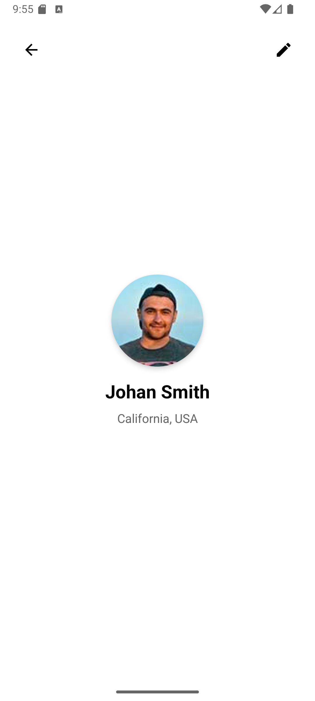

Câu 1: Mong muốn và định hướng của bạn sau khi học xong môn học là gì?
Sau khi học xong môn Lập trình di động:
 - Em mong muốn nắm vững được kiến thức cơ bản về phát triển ứng dụng trên Android
 - Biết cách thiết kế giao diện, xử lý sự kiện và kết nối dữ liệu
 Định hướng: 
 - Có thể tự xây dựng được các ứng dụng nhỏ phục vụ học tập hoặc đời sống
 - Dồng thời lấy nền tảng này để phát triển thêm các kỹ năng, chuẩn bị cho công việc thực tế trong lĩnh vực lập trình ứng dụng di động.

Câu 2: Theo bạn, trong tương lai gần (10 năm) lập trình di động có phát triển không? Giải thích tại sao?

Theo em, trong 10 năm tới lập trình di động sẽ tiếp tục phát triển mạnh. Nguyên nhân là vì:
- Điện thoại thông minh ngày càng phổ biến và gần như ai cũng sử dụng.
- Nhu cầu ứng dụng di động đa dạn: mua sắm online, học tập, giải trí, y tế, tài chính… đều cần app.
- Công nghệ mới như AI, AR/VR đang được tích hợp vào ứng dụng di động.

Câu 3: Viết một ứng dụng có UI như sau đẩy lên github
Mục tiêu:
- Làm quen với Android UI cơ bản (ImageView, TextView, LinearLayout/ConstraintLayout).
- Hiển thị thông tin cá nhân (ảnh đại diện, tên, địa chỉ).
- Push code lên GitHub.
Kết quả đạt được:
- Ứng dụng Android hiển thị màn hình với ảnh đại diện, tên, địa chỉ như trong hình.

Output:

